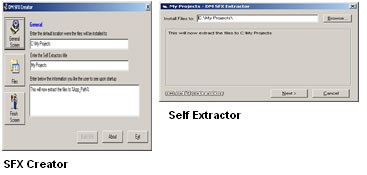



## DM Self Extractor / Creator

### Description

hello all,

This is a project I made about 3 hours ago. that is a self extractor and Creator. Yer I know it done in VB and requires Runtimes. but if you just want to install small files like screen savers and you know your users have runtimes it should be ok.

anyway please read the information in the creator file. I also commented 98% of all the code. Hope you like it. Hope you like the code please vote.
 
### More Info
 

             |
---                |---
**Submitted On**   |2001-08-17 21:46:50
**By**             |[dreamvb](https://github.com/Planet-Source-Code/PSCIndex/blob/master/ByAuthor/dreamvb.md)
**Level**          |Intermediate
**User Rating**    |5.0 (30 globes from 6 users)
**Compatibility**  |VB 6\.0
**Category**       |[Complete Applications](https://github.com/Planet-Source-Code/PSCIndex/blob/master/ByCategory/complete-applications__1-27.md)
**World**          |[Visual Basic](https://github.com/Planet-Source-Code/PSCIndex/blob/master/ByWorld/visual-basic.md)
**Archive File**   |[DM\_Self\_Ex1783318182004\.zip](https://github.com/Planet-Source-Code/dreamvb-dm-self-extractor-creator__1-55665/archive/master.zip)

